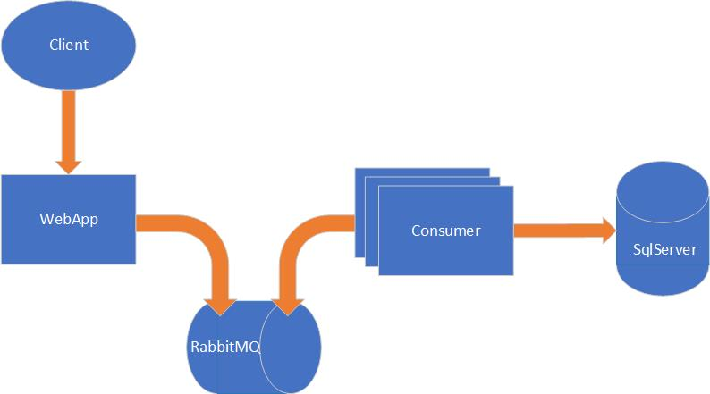

# netcore6-rabbit-example
Minimalistic example of producer / consumer written in dotnet 6.0 with a RabbitMQ and SqlServer on Docker.

**Warning** This code is not production ready.

## Requirements
You will need to have [Docker](https://docs.docker.com/engine/install/) and [Docker-compose](https://docs.docker.com/compose/install/) installed in your host.

## Installation

1. Clone the repo `git clone https://github.com/jandresleiva/netcore6-rabbit-example.git`
2. Get into de folder and run docker-compose in detached mode
3. Update the volumes location in the `docker-compose.yml` file on lines 15, 37, 38. And change the `{CLONING_PATH}` placeholders for the actual absolute path to the folder where you did git clone.
4. Run the docker-compose in detached mode.

```
cd netcore6-rabbit-example
docker-compose up -d
```
3. Wait. This will automatically run the basic migrations for you, creating the DB schemas, and this may take a few minutes depending on the computer.
4. Get into the rabbitMQ dashboard `http://localhost:15672`, and using the credentials admin:mqpass1234 you should be able to see the new queues.
5. Get into the published webpage `http://localhost:8080`, and you should be able to publish some key-value throught he interface.
6. Now in the dashboard you should be able to see the job published into the queue.
7. Inspect the consumer container, and you should see the job that got published being processed and the key-value printed out
8. Get into the SqlServer instance (you can use [Microsoft SQL SMS](https://docs.microsoft.com/en-us/sql/ssms/download-sql-server-management-studio-ssms?view=sql-server-ver15)), and verify the data was stored properly.

## Architecture


